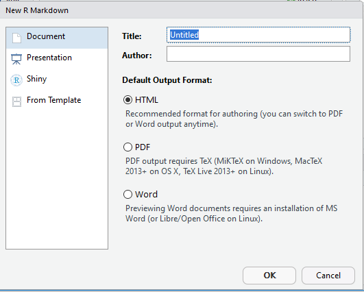
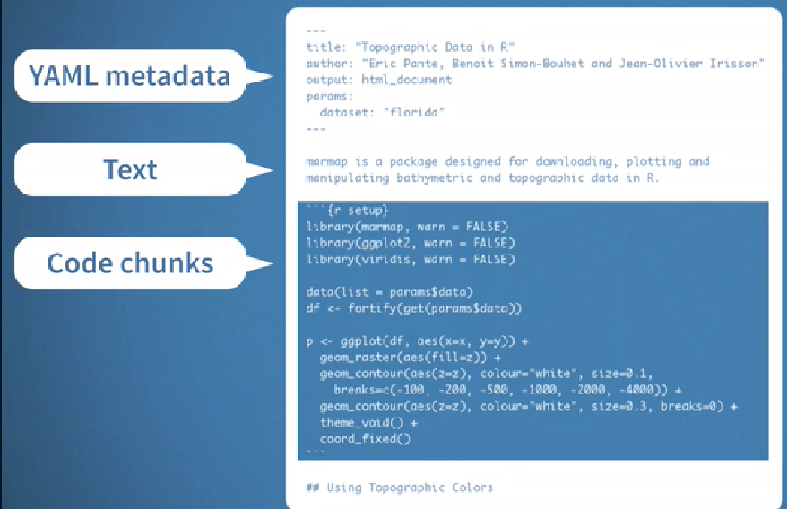

## R Markdown

[R Markdown](https://rmarkdown.rstudio.com/) es un sistema para análisis de datos reproducibles y publicación de _"salidas"_ desde `R`, incluyendo documentos, presentaciones, libros, blogs, _dashboards_ y sitios webs. 

<span style="display:block; height: 2 cm;"></span>

```{r, echo=FALSE,fig.align='center'}
      knitr::include_graphics('assets/img/rmarkdown.png')
```

--- .class #id 

## R Markdown 

<span style="display:block; height: 3 cm;"></span>


+  Guardar y ejecuatar código. 


<span style="display:block; height: 3 cm;"></span>


+  Generar reportes de alta calidad con el objetivo de ser compartidos. 


---&twocol

## Configurando la sesión de trabajo.....

### Paquetes requeridos 

   + `rmarkdown` y  `knitr`
   
### Abrir un archivo `.Rmd`

*** {name: left}
```{r, echo=FALSE,fig.align='center'}
      knitr::include_graphics('assets/img/r2.png')
```

*** {name: right}
```{r, echo=FALSE,fig.align='center'}
      
```

--- 

## Estructura archivo `.Rmd`


```{r, echo=FALSE,fig.align='center'}
      
```


--- 


